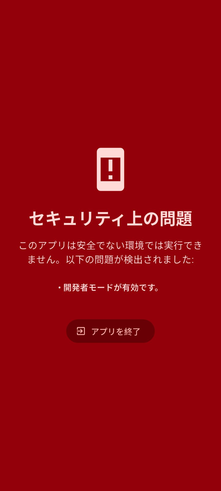
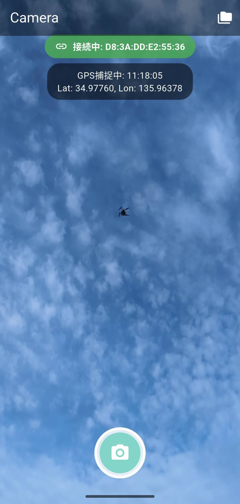
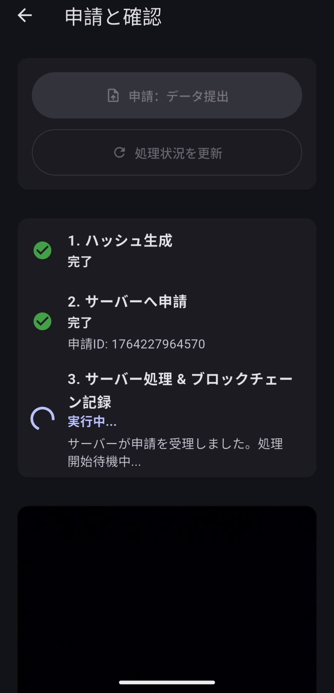

# ZKP Location Proof System


# 1. Introduction

## Problem Statement

This project aims to solve the dual challenges of ensuring data reliability and protecting the privacy of location information and related data generated by IoT devices (especially drones). Specifically, we are addressing the following issues:

* **Location Privacy Risks:** The risk of exposing personal behavioral history and confidential information when raw location data collected by devices is made public.

* **Data Reliability Issues:** The difficulty of verifying that collected location information has not been tampered with, and ensuring the transparency of the verification process itself.

* **Verification Costs in Decentralized Systems:** The high transaction costs and scalability limitations when recording data on Distributed Ledger Technologies (DLT) like blockchains.

## Background (Social and Technical Challenges)

With the rapid adoption of drones and other IoT devices in recent years, a massive amount of data is being generated. While this data—particularly location information—is utilized in various fields such as logistics, surveillance, and autonomous driving, concerns regarding its accuracy and privacy protection are growing. Zero-Knowledge Proof (ZKP) is an innovative technology that allows one to prove the truth of an assertion without revealing the specific contents of the information. It is expected to be a powerful solution to these challenges.

## Why This Project is Necessary

By applying ZKP technology to IoT data verification, this project enables the following:

* **Private Proofs:** Proving that a drone was at a specific location or followed a specific route without disclosing detailed latitude and longitude information.

* **Tamper Resistance:** Guaranteeing the authenticity and immutability of data by recording ZKPs on the blockchain.

* **Efficient Verification:** Reducing on-chain verification costs by verifying ZKPs via smart contracts while processing complex data off-chain.

## Target Use Cases

* **Drone Flight Path Auditing:** Proving to third parties that a drone flew in a specific area while keeping the exact path private.

* **Ensuring Supply Chain Transparency:** Proving the location of packages in logistics using ZKP to enhance tracking reliability.

* **IoT Device Authentication:** Strengthening security by proving that a device is physically present in a specific location.

# 2. Overview / Abstract

## System Summary

This system is an end-to-end solution composed of a Flutter-based mobile client application and a Node.js-based backend server. It uses Zero-Knowledge Proof (ZKP) technology to verify the reliability of location information from IoT devices (drones) and records the proof on a blockchain. Based on the location data acquired by the client, the server generates a ZKP, cross-references it with drone data stored on IPFS, and permanently records the result on the blockchain.

## Key Features

**Mobile Client (Flutter):**

* Image capture via camera

* Location tracking and history management via GPS

* Drone ID detection via Bluetooth LE

* Local Poseidon hash generation based on acquired data and performance evaluation (benchmarking)

* Security checks (Root detection, developer mode detection, etc.)

* Data submission to the server

* Local record saving and management in a database

**Backend Server (Node.js):**

* Receiving and storing data (images, hashes, drone IDs) from the client

* Uploading data to IPFS and monitoring it (via IPNS)

* Generating ZKPs (Groth16) using Circom circuits

* Recording generated ZKPs on the blockchain (Ethereum Sepolia)

* Managing and tracking submission statuses

## Tech Stack

* **UAV:** DJI Matrice 300 RTK + Raspberry Pi 4 (GNSS: ZED-F9P)

* **Mobile:** Google Pixel 8 (Android 14)

* **Frontend:** Flutter (Dart)

* **Backend:** Node.js, Express.js

* **Zero-Knowledge Proof:** Circom, snarkjs (Groth16)

* **Blockchain Integration:** ethers.js (Primarily utilizing Polygon PoS Amoy Testnet)

* **Decentralized Storage:** IPFS

* **Database:** SQLite (Client-side), File System (Server-side)

* **Security:** Libraries referenced in papers (Flutter), such as `safe_device` (Root detection) and `flutter_blue_plus` (Remote ID detection)

## Target Users

* **Drone Operating Companies:** Companies requiring proof of drone flights and auditing.

* **Regulatory Authorities:** Organizations interested in preventing unauthorized drone use and verifying flight paths.

* **ZKP Developers:** Engineers and researchers interested in real-world applications of ZKP.

* **Privacy-Conscious Users:** Individuals who want their location data handled securely.

# 3. Architecture

## System Architecture Diagram

*(Insert Architecture Diagram Here)*

## Data Flow

1. **Data Acquisition (Client: `lib/main.dart`):** The mobile client captures an image via the camera (`_controller.takePicture()`), acquires GPS location data (`_location.onLocationChanged.listen`), and detects a specific drone ID (`_targetDroneId`) via Bluetooth LE (`FlutterBluePlus.scanResults.listen`).

2. **Local Processing (Client: `lib/main.dart`):** Based on the location data and capture time, the `_generateAllHashes` function generates Poseidon hashes across multiple time windows and benchmarks the performance. The results are saved to SQLite using `LocalDatabaseHelper.instance.createRecord`.

3. **Server Submission (Client: `lib/main.dart` -> Server: `server.cjs`):** The client sends the image file (`imageXFile.path`), drone ID, and generated hashes to the backend server's `/submit` endpoint using an `http.MultipartRequest` inside the `_submitApplication` function.

4. **Server-side Data Storage (Server: `server.cjs`):** The server's `/submit` endpoint receives the data via the multer middleware and temporarily stores it in the `uploads/` directory. The submission status is recorded in `submission-status.json` via the `updateSubmissionStatus` function.

5. **IPFS Upload (Server: `server.cjs`):** Inside the `/submit` endpoint, the entire submitted directory is uploaded to IPFS using `ipfs.addAll`, and its CID is recorded via `updateSubmissionStatus`.

6. **IPFS Watcher (Server: `server.cjs`):** The `startIpfsWatcher` function allows the server to periodically monitor IPFS/IPNS to detect data updates related to specific drone IDs based on `ipns-names.json`. The `ipfs/retrieve-data.mjs` script is called as an external process.

7. **ZKP Generation (Server: `server.cjs`):** When an update is detected by the IPFS watcher, the `processAllSubmissions` function is executed. This function generates Circom inputs (`input.json`) via the `prepareInputs` function, using the drone data retrieved from IPFS and the hashes submitted by the client (read from `user_data.json`). Then, `child_process.execSync` is used to calculate the Witness (`witness.wtns` via `snarkjs wtns calculate`) and generate the Groth16 proof (`proof.json`, `public.json` via `snarkjs groth16 prove`).

8. **Blockchain Recording (Server: `server.cjs`):** Within the `processAllSubmissions` function, the generated ZKP's public inputs and proof (calldata generated by `snarkjs zkey export soliditycalldata`) are recorded on the Ethereum Sepolia blockchain through a deployed smart contract (`contract.recordProof`) using ethers.js. A transaction hash is issued, and the submission status is updated.

## Component Description

* **Mobile App (Flutter):** Uses `lib/main.dart` as the entry point, providing the UI for camera/GPS/BLE data collection in `CameraScreen` (`_CameraScreenState`), local record management in `LocalHistoryScreen`, and the ZKP submission flow in `VerificationScreen`. The `LocalDatabaseHelper` class abstracts the SQLite database.

* **Backend Server (Node.js):** Uses `server.cjs` as the entry point and defines API endpoints with express. Processes file uploads with multer and executes external ZKP tools (snarkjs) using `child_process`. Communicates with the blockchain via ethers.js (`contract`).

* **Blockchain (Ethereum Sepolia):** A smart contract (ABI defined as `CONTRACT_ABI`) deployed at the address specified in `deployed-address.json` permanently records ZKP verification results through the `recordProof` function.

* **ZKP Circuit (Circom/snarkjs):** Executed by the snarkjs command-line tool on the server. It uses `./merkle_js/merkle.wasm` (for Witness calculation) and `merkle_final.zkey` (for Groth16 proof generation) to generate a zero-knowledge proof proving that the provided inputs satisfy specific conditions. ZKP inputs are formatted by the `prepareInputs` function (`./prepare_inputs.js`).

* **IPFS (InterPlanetary File System):** Connects to an IPFS node via the `ipfs-http-client` library. Uploads contents of the `uploads/` directory to IPFS and monitors specific drone data updates using `ipns-names.json` and `ipfs/retrieve-data.mjs`.

# 4. Technical Details / Method

## Technologies Used

**Client:**

* **Flutter (Dart):** UI framework. `lib/main.dart` is the entry point.

* **camera** (`package:camera/camera.dart`): Device camera access and image capture.

* **location** (`package:location/location.dart`): Real-time GPS location tracking.

* **flutter_blue_plus** (`package:flutter_blue_plus/flutter_blue_plus.dart`): Bluetooth LE device scanning and drone ID detection.

* **sqflite** (`package:sqflite/sqflite.dart`): Data storage and retrieval to/from a local SQLite database.

* **poseidon** (`package:poseidon/poseidon.dart`): ZKP-friendly hash function. Calculates hashes from location data on the client side.

* **safe_device** (`package:safe_device/safe_device.dart`): Detects device rooting/jailbreaking and developer mode.

**Server:**

* **Node.js:** Runtime environment. `server.cjs` is the entry point.

* **Express.js:** Web application framework. Defines REST API endpoints.

* **multer:** Handling `multipart/form-data`. Processes image file uploads.

* **ethers.js:** Ethereum blockchain integration.

* **dotenv:** Environment variable management (`.env` file).

* **ipfs-http-client:** IPFS node integration.

* **child_process:** Executes external commands (snarkjs).

**ZKP:**

* **Circom:** ZKP circuit development language. Circuits are defined in the `circom/` directory.

* **snarkjs:** ZKP prover/verifier tool. Used for Witness generation and proof generation (Groth16).

* `merkle_js/merkle.wasm`: WebAssembly file compiled from the Circom circuit.

* `merkle_final.zkey`: The final ZKey used during Groth16 proof generation.

**Data Store:**

* **Client:** SQLite (`zkp_verifier_v3.db`). Managed by the `LocalDatabaseHelper` class.

* **Server:** File System (`uploads/`, `submission-status.json`, `ipns-names.json`).

## API Specifications

### Server Endpoints (Defined in `server.cjs`)

#### `POST /submit`

* **Description:** Receives data from the client for ZKP generation.

* **Format:** `multipart/form-data`

* **Request Body:**

  * `image`: Type File. The uploaded image file.

  * `hash`: Type string. Newline-separated string of hash values generated by the client.

  * `droneId`: Type string. Drone ID.

  * `captureTime`: Type string. Capture time in ISO 8601 format.

  * `durationSeconds`: Type string. The selected duration.

* **Response:** JSON `{ message: 'Submission accepted.', submissionId: <string> }`

* **Error Response:** status 400 (Bad Request) or status 500 (Server Error).

#### `GET /submission-status/:submissionId`

* **Description:** Returns the processing status for a specific `submissionId`.

* **Path Parameter:** `submissionId` (Type string).

* **Response:** JSON `{ status: <string>, ipfsCid: <string>?, transactionHash: <string>?, blockNumber: <number>?, performance: <object>?, error: <string>?, lastUpdated: <ISO 8601 string> }`

* **Error Response:** status 404 (Submission ID not found).

#### `POST /record-on-chain`

* **Description:** Records the ZKP generated on the server to the blockchain. (Internal call within `processAllSubmissions`).

* **Response:** JSON `{ transactionHash: <string> }`

#### `GET /get-proof-events`

* **Description:** Fetches and formats `ProofRecorded` event logs from the smart contract.

* **Response:** JSON Array of `{ transactionHash: <string>, blockNumber: <number>, timestamp: <string>(JST), pubSignals: <string[]> }`

* **Error Response:** status 500 (Blockchain connection error, etc.).

## Data Structures

* **LocalRecord (Client-side - SQLite):** Defines the data structure saved in the `records` table.

  * `id`: int?. Unique identifier.

  * `captureTime`: DateTime (ISO 8601).

  * `maxDuration`: int. Maximum duration (seconds).

  * `droneId`: String. Drone ID.

  * `imagePath`: String. Local file path of the captured image.

  * `hashesMap`: Map<int, List<String>>. JSON string of generated hashes.

* **ProcessLog (Client-side - UI):** Data structure for managing UI display states for each step.

* **submission-status.json (Server-side):** Tracks processing status of each submission.

* **ZKP Inputs (`input.json`):** Input data for the Circom circuit generated via `prepareInputs` (`hashes`, `droneData`).

## Protocol Design

* **Client-Server Communication:** Secure HTTPS communication using self-signed certificates (development environment) via `http.MultipartRequest`.

* **ZKP Generation Protocol (Groth16):** Orchestrated by `processAllSubmissions` in `server.cjs` using snarkjs for Witness calculation, Proof generation, and Calldata export.

* **Blockchain Integration:** Uses `ethers.js` to send transactions to the Ethereum Sepolia blockchain, permanently recording the ZKP via the `recordProof` smart contract function.

* **IPFS/IPNS:** Uploads submissions using `ipfs-http-client` and monitors IPNS updates.

## Algorithms

* **Poseidon Hash (Client-side):** Applies a proprietary "5x5 grid search model (rounding to the 4th decimal place)" accounting for GPS errors, and uses the ZKP-friendly `poseidon3([latInt, lonInt, targetTimeInt])` hash function.

* **Groth16 (Server-side):** Generates proofs via `snarkjs groth16 prove` using generated inputs, `.wasm` files, and `.zkey` files.

# 5. Setup / Installation

To run this project, you need to set up both the client (Flutter) and server (Node.js) environments.

## Prerequisites

* **Flutter SDK:** Latest stable version

* **Node.js:** v18 or higher (LTS recommended)

* **npm or Yarn:** Node.js package manager

* **Git:** Source code management

* **IPFS Daemon (Optional):** If interacting with a local IPFS node

* **Ethereum Wallet and Sepolia Testnet ETH:** For issuing transactions to the blockchain

## Dependencies

### Client (Flutter)

Dependencies listed in `pubspec.yaml` will be resolved automatically using the `flutter pub get` command.

### Server (Node.js)

Dependencies listed in `package.json` will be installed using `npm install` or `yarn install`.

## Installation Steps

1. **Clone the Repository:**
```bash
git clone [https://github.com/your-username/poseidon_hash_zkp.git](https://github.com/your-username/poseidon_hash_zkp.git)
cd poseidon_hash_zkp

```

2. **Client Setup:**
```bash
cd poseidon_client
flutter pub get
# For iOS (first time only)
# cd ios && pod install && cd ..

```


3. **Server Setup:**
```bash
cd ../server
npm install # or yarn install

```


4. **ZKP Circuit Compilation and Trusted Setup (Development Only):**
If `merkle_js/merkle.wasm` and `merkle_final.zkey` do not exist, compile them:
```bash
npm install -g circomlibjs snarkjs

# Compile Circom circuit
circom circom/merkle.circom --wasm --r1cs -o circom/
mv circom/merkle_js/merkle.wasm merkle_js/

# Trusted Setup (Requires pot19_final.ptau)
snarkjs groth16 setup circom/merkle.r1cs pot19_final.ptau merkle_final.zkey

```


## Environment Variables

Create a `server/.env` file and configure the following variables:

```env
SEPOLIA_RPC_URL=your_rpc_endpoint_url
PRIVATE_KEY=your_ethereum_wallet_private_key

```

*(Never hardcode the private key directly into the source code in a production environment.)*

# 6. Usage

## Starting the Server

Run the following command from the project root directory to start the server:

```bash
node server.cjs

```

The server will start listening on `https://localhost:3000`.

## Running the Client App

Run the following command in the Flutter project root directory to deploy the app to a device or emulator:

```bash
flutter run

```

## Demo Steps

1. **Launch the Client App:** Open the app on your device.
2. **Detect Drone:** The app searches for a specific drone ID (`D8:3A:DD:E2:55:36`) via Bluetooth LE.
3. **Acquire GPS:** The app acquires GPS location data.
4. **Capture Photo:** Tap the shutter button at the bottom of the screen.
5. **Performance Evaluation:** The app generates hashes 30 times across multiple durations and measures the average processing time.
6. **Performance Report:** Results are displayed in a dialog.
7. **Navigate to Verification Screen:** Tap "Proceed".
8. **Select Proof Duration:** Select the hash duration to submit to the server.
9. **Submit to Server:** Tap the "Submit to Server" button.
10. **Record on Blockchain:** Once ZKP generation is complete, tap "Record on Blockchain" to record the proof on Ethereum Sepolia.
11. **Verify Transaction:** Verify the transaction hash on Etherscan.

| Safe Environment | Photo Capture | Data Submission |
| --- | --- | --- |
|  |  |  |

## API Usage Example (Server)

```javascript
// Example using Node.js fetch API
const FormData = require('form-data');
const fs = require('fs');

const formData = new FormData();
formData.append('image', fs.createReadStream('/path/to/your/image.jpg'));
formData.append('hash', 'hash1\nhash2\nhash3'); // Hashes generated by the client
formData.append('droneId', 'D8:3A:DD:E2:55:36');
formData.append('captureTime', new Date().toISOString());
formData.append('durationSeconds', '30');

fetch('https://localhost:3000/submit', {
    method: 'POST',
    body: formData,
    // When using a self-signed certificate, you may need to ignore unauthorized errors in Node.js
    // agent: new (require('https').Agent)({ rejectUnauthorized: false })
})
.then(res => res.json())
.then(data => console.log(data))
.catch(error => console.error(error));

```

# 7. Evaluation / Benchmark

## Performance Evaluation

The client application incorporates a feature to measure the calculation time of the Poseidon hashes, which serve as inputs for ZKP generation.

* **Metrics:** Average processing time (in milliseconds) generated 30 times for specified durations (e.g., 10s, 20s, ..., 60s).
* **Format:** Tabular report within the application (copyable to CSV).

## Experimental Environment

**Client:**

* **Device:** Google Pixel
* **OS:** Android
* **CPU:** Google Tensor Series

**Server:**

* **Device:** Mac (Intel Core i5, 2018)
* **OS:** macOS
* **CPU:** Intel Core i5
* **RAM:** 16GB
* **Network:** Wi-Fi / Wired LAN
* **Blockchain:** Ethereum Sepolia Testnet

## Results

* **Mobile Hash Generation:** 0.87 seconds (for 60 seconds of data)
* **ZKP Proof Generation:** Approx. 25 seconds
* **Gas Fees Comparison:** Adopting L2 (Polygon PoS Amoy Testnet) significantly reduced gas fees compared to traditional direct recording on L1 (Ethereum Sepolia).
*(Example: Approx. 113 JPY on Ethereum Sepolia vs. Approx. 0.13 JPY on Polygon PoS Amoy Testnet)*
* Client-side security check overhead was negligible.

## Comparison

* "Compared to traditional direct data recording on the blockchain, using ZKPs reduced on-chain transaction gas fees by $N$%."
* "In comparison to similar ZKP-based location proof systems, this system demonstrated superiority in client-side processing performance and efficient off-chain data management."

# 8. Security Consideration

## Threat Model

* **Malicious Client:** Attempting to submit fake location data, fake drone IDs, or tampered hashes.
* **Server Compromise:** A hacked server where the ZKP generation process or IPFS/Blockchain integrations are abused.
* **Network Attacks:** Eavesdropping, tampering, or replay attacks.
* **Device Compromise:** Modifying app behavior via rooting/jailbreaking.
* **ZKP Circuit/Smart Contract Vulnerabilities:** Flaws leading to false proofs, privacy leaks, or loss of assets.

## Attack Resistance

* **Privacy via ZKP:** Protects privacy by proving facts without exposing raw location data.
* **Immutability via Blockchain:** Recorded ZKPs cannot be tampered with.
* **Secure Communication:** HTTPS encryption prevents eavesdropping.
* **Anti-Rooting Measures:** Refuses to execute in unsafe environments using the `safe_device` library.
* **Separation of Concerns:** Client handles collection, Server handles generation/recording.

## Privacy Design

* **Data Concealment via ZKP:** Specific location coordinates are not recorded on the blockchain.
* **Use of IPFS:** Supplementary information is stored decentralized, enhancing availability and censorship resistance.

# 9. Limitations

* **ZKP Circuit Complexity:** Current circuits are specialized. Complex logic requires redesigning.
* **Scalability:** ZKP generation on the server is computationally expensive.
* **Network Dependency:** IPFS and blockchain network performance affects response times.
* **Self-Signed Certificates:** Requires additional validation logic on the client side.
* **Generalization of Drone Data:** Currently relies on IPNS monitoring.
* **Battery Consumption:** GPS tracking and Bluetooth scanning consume device battery.
* **Environment Setup Complexity:** Complex tech stack (Flutter, Node.js, IPFS, Circom, Ethereum).

# 10. Future Work

* **Introduction of Advanced ZKP Features:** Supporting complex geospatial queries and integrating scaling solutions (ZK-Rollups/Starkware).
* **Multi-chain Support:** Expanding to Polygon, Solana, etc.
* **Enhanced Device Integration:** Supporting broader IoT devices and hardware-level security (TEE).
* **Optimization of Real-time Processing:** Parallelization and WebAssembly offloading.
* **User Interface Improvements:** Refining UX/UI.
* **Contribution to Standardization:** Developing standard protocols for IoT + ZKP + Blockchain.

# 11. Contributing

Contributions to this project are welcome. Please follow the guidelines below:

* **Creating Issues:** Submit bug reports, feature requests, and improvement proposals via the GitHub Issue Tracker.
* **Creating Pull Requests (PR):**
* Group your changes into meaningful, small units.
* Ensure each PR addresses one specific issue or feature.
* Respect existing coding conventions and styles.
* Ensure related tests pass successfully.
* Include detailed commit messages and a PR description.


* **Branching Strategy:** Use topic branches (`feature/your-feature` or `bugfix/issue-number`) against the `main` branch.

# 12. License

*(Please include the license information for this project here. Example: MIT License, Apache 2.0 License, etc.)*

# 13. References

* **Papers on Zero-Knowledge Proofs:**
* [Groth16: On the Size of Pairing-based Non-interactive Arguments](https://eprint.iacr.org/2016/260)
* [Circom Documentation](https://docs.circom.io/)
* [snarkjs Documentation](https://github.com/iden3/snarkjs)


* **Information on the Poseidon Hash Function:**
* [Poseidon: A New Hash Function for ZKP](https://eprint.iacr.org/2019/458)


* **IPFS and IPNS:**
* [IPFS Documentation](https://docs.ipfs.tech/)
* [IPNS Documentation](https://docs.ipfs.tech/concepts/ipns/)


* **Ethereum and ethers.js:**
* [Ethereum Documentation](https://ethereum.org/en/developers/docs/)
* [ethers.js Documentation](https://docs.ethers.org/v6/)


* **Flutter:**
* [Flutter Documentation](https://docs.flutter.dev/)


```

```
